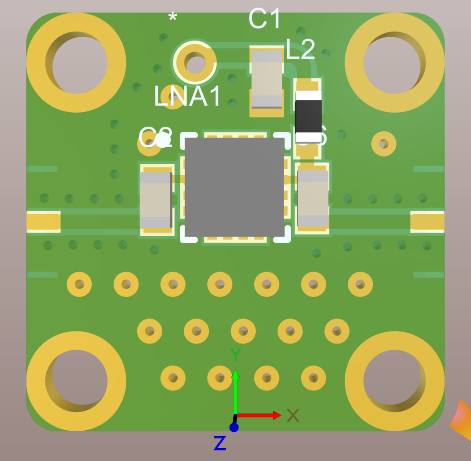

# Layout e componentes de características distribuídas 

O Layout da placa diz respeito ao posicionamento e dimensão das trilhas e componentes que compõe o circuito. É a manifestação física do esquemático da placa.

Para este projeto, existem os seguintes pre-requisitos:
- Conector MicroRF e cabo para SMA
- Conversor DC/DC para células de lítio com saída para 7,4V 4A
- Conector Dados com SPI, I2C, GPIO (2 I/O)

Por se tratar de uma placa que deve operar com sinais de alta frequência, alguns cuidados adicionais devem ser tomados:

- Impedância das trilhas deve ser controlada
- A frequência do ripple dos níveis DC não pode causar interferência nos sinais AC

Dados esses dois cuidados, algumas conclusões podem ser tiradas: 

- Trabalharemos com impedâncias controladas o mais próximo possível de 50 ohms;
- Cada componente do circuito deve ter seu próprio conversor DC/DC, para que não causem interferência entre si;
- O circuito de conversão DC/DC deve ser apropriado para circuitos de RF

Abaixo um vídeo exemplificando como será a estratégia de desenvolvimento das placas:

Pode-se observar a modularidade de cada parte do circuito, podendo fazê-lo a medida que os componentes vão sendo selecionados.

## Parâmetros das placas e conectores:

***Características da placa:

- 4 camadas;
- 3 dielétricos;
- espessura de condutores: 0.14mm;
- espessura dos dielétricos: 0.635mm;
- espessura total: 0.795mm

Layer Stack Manager:

***Conectores:

Os conectores usados são groud-signal-ground (gsg) Jumpers. São feitos de um pequeno pedaço de material de poliamida com traços de cobre desenhados para terem impedância de 50 ohms na direção do sinal. Para fixação, o conector é disposto entre duas placas e duas âncoras de forma que fica fixo em cada placa, assegurando conexão. A conexão foi testada com ótimos resultados com frequências até 67GHz, ou seja, para nossa aplicação o conector é válido. 

Quanto aos seus parâmetros s, duas placas conectadas por um gsg Jumper se comportam como uma única linha de transmissão de mesmo tamanho.

Seu Serial number é: XM-GSGJ-01

%- Deverão ser especificados os parâmetros das linhas de transmissão, tipo de LT utilizado.

## Blocos de circuito:

- atenuador: HMC542
- LNA: TQP3M9019
- Gain Block: LMH6881
- Mixer: ADE-12MH
- LO: Si4464
- Chave RF: ADG904BCPZ

## Detalhamento dos componentes:

### Atenuador HMC542

### LNA: TQP3M9019

Layout recomendado pelo fabricante:

Para frequência de operação na faixa 108 a 137 MHz, foram usados os valores 4.7nF e 100nF para os capacitores e 330pH para o indutor

Após o posiciomentos dos componentes, este ficou o layout do módulo do LNA:

### Gain Block: LMH6881

Componente foi criado no vault.

### Mixer: ADE-12MH

O mixer foi dado como exemplo para desenvolvimento das demais placas:

Esquemático utilizado:

Layout do módulo do Mixer ADE-12MH

### LO: Si4464

### Chave RF: ADG904BCPZ

